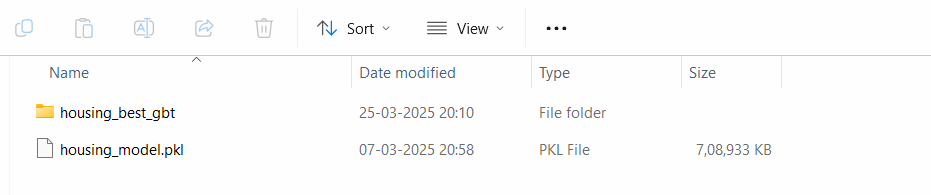

# 🏠 Housing Price Prediction App

This project provides an interactive **web-based housing price prediction tool** built using **Streamlit**, capable of running two powerful machine learning pipelines:
- **Scikit-learn (Random Forest)** for lightweight, local predictions
- **Apache Spark MLlib (GBTRegressor)** for scalable big data predictions

---

## 🚀 Features

### 🔍 1. Single Record Prediction
- Enter housing features manually through a clean Streamlit form.
- Predict median house value using:
  - **Scikit-learn (main.py)** — locally trained `RandomForestRegressor`
  - **PySpark (app.py)** — trained `GBTRegressor` pipeline using Apache Spark

### 📊 2. Batch Prediction
- Upload a `.csv` or `.xlsx` file containing multiple property records.
- Receive a downloadable Excel sheet with predicted prices (PySpark only).

### 🧪 3. Dummy Data Generation
- Script `dummydata.py` auto-generates 10,000 rows of realistic housing data.
- Helps in testing batch predictions and evaluating model scalability.

### 🐳 4. Docker Support
- Includes a `Dockerfile` for containerized deployment of the full app.

---

## 🧠 Models Used

- **Scikit-learn Pipeline (`main.py`)**
  - Preprocessing with `StandardScaler` and `OneHotEncoder`
  - Model: `RandomForestRegressor`
  - Deployed via `joblib` for fast, local inference

- **PySpark Pipeline (`app.py`)**
  - Built using `Spark MLlib` with `GBTRegressor`
  - Suitable for larger batch predictions and scalable environments
  - 


---

## 🏗️ Tech Stack

| Tool/Library     | Purpose                          |
|------------------|----------------------------------|
| **Python**       | Core programming language        |
| **Streamlit**    | Interactive UI for input/output  |
| **Scikit-learn** | ML model training + prediction   |
| **PySpark**      | Scalable ML pipeline (Spark ML)  |
| **Pandas/Numpy** | Data wrangling and manipulation  |
| **Joblib**       | Model + Scaler persistence       |
| **Docker**       | Containerization for deployment  |

---

## 📁 Project Structure

```bash
bigdata_realestate/
│
├── app.py               # PySpark Streamlit app
├── main.py              # Scikit-learn Streamlit app
├── dummydata.py         # Generates 10k dummy housing records
├── Dockerfile           # Docker container setup
├── scaler.pkl           # Pre-fitted StandardScaler (for main.py)
├── housing_model.pkl    # Trained Random Forest model (for main.py)
├── housing_best_gbt/    # Saved Spark ML pipeline (used by app.py)
└── dummy_data.xlsx      # Sample generated data
